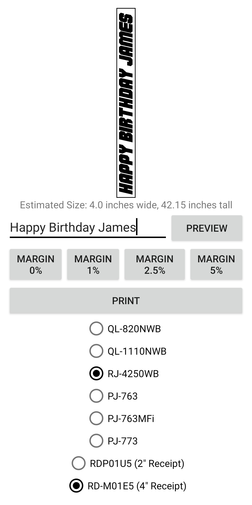

# Banner Printer 

**Print large signs on regular printers and Brother label makers.**

Banner Printer supports the printing of large signs on Brother label makers and regular printers.

# Development Overview

This is a Native Android application targeting SDK version 19 or higher (Android 4.4)

## Developer Setup

A full gradle project is provided but there are dependencies that are not bundled.
**Dependencies:** [Brother Print Library](https://developerprogram.brother-usa.com/sdk-download)
